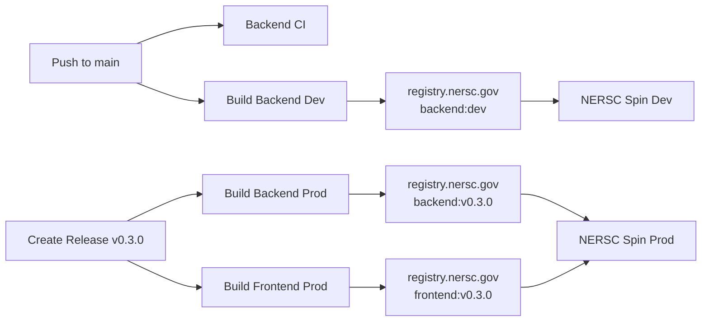

# SimBoard Documentation

This directory contains all documentation for the SimBoard project.

---

## 📁 Directory Structure

```
docs/
├── README.md          # This file - documentation index
└── cicd/              # CI/CD and deployment documentation
    ├── QUICKSTART.md
    ├── DEPLOYMENT.md
    ├── GITHUB_SECRETS.md
    ├── REFERENCE.md
    └── IMPLEMENTATION_SUMMARY.md
```

---

## 📚 CI/CD Documentation

All CI/CD and deployment documentation is located in the [`cicd/`](cicd/) directory.

| Document | Purpose | Audience | Size |
|----------|---------|----------|------|
| [cicd/QUICKSTART.md](cicd/QUICKSTART.md) | Quick setup guide | Admins & DevOps | 8 KB |
| [cicd/DEPLOYMENT.md](cicd/DEPLOYMENT.md) | Comprehensive deployment guide | Everyone | 15 KB |
| [cicd/GITHUB_SECRETS.md](cicd/GITHUB_SECRETS.md) | GitHub Secrets configuration | Admins | 4 KB |
| [cicd/REFERENCE.md](cicd/REFERENCE.md) | Workflow quick reference | Developers | 7 KB |
| [cicd/IMPLEMENTATION_SUMMARY.md](cicd/IMPLEMENTATION_SUMMARY.md) | Implementation details | Maintainers | 9 KB |

**Total Documentation:** 43 KB across 5 documents

---

## 🎯 Where to Start

### I'm a Repository Administrator
**Goal:** Set up GitHub Secrets and enable CI/CD

👉 Start here: [cicd/QUICKSTART.md](cicd/QUICKSTART.md) (Steps 1-4)

Then: [cicd/GITHUB_SECRETS.md](cicd/GITHUB_SECRETS.md) for detailed setup

---

### I'm a DevOps Engineer
**Goal:** Deploy containers to NERSC Spin

👉 Start here: [cicd/QUICKSTART.md](cicd/QUICKSTART.md) (Steps 5-6)

Then: [cicd/DEPLOYMENT.md](cicd/DEPLOYMENT.md) for full deployment guide

---

### I'm a Developer
**Goal:** Understand how to trigger builds and cut releases

👉 Start here: [cicd/REFERENCE.md](cicd/REFERENCE.md) for workflow overview

Then: [cicd/DEPLOYMENT.md](cicd/DEPLOYMENT.md) → [Production Release Process](#production-release-process)

---

### I'm a Maintainer
**Goal:** Understand implementation details and architecture

👉 Start here: [cicd/IMPLEMENTATION_SUMMARY.md](cicd/IMPLEMENTATION_SUMMARY.md)

Then: [cicd/DEPLOYMENT.md](cicd/DEPLOYMENT.md) for complete reference

---

## 📖 Document Descriptions

### [cicd/QUICKSTART.md](cicd/QUICKSTART.md)
**Quick Start: CI/CD Setup**

Step-by-step guide to:
- Configure GitHub Secrets (5 min)
- Test dev backend builds (5 min)
- Update NERSC Spin deployments (10 min)
- Cut a test release (10 min)

**When to use:** First-time setup or onboarding new team members

---

### [cicd/DEPLOYMENT.md](cicd/DEPLOYMENT.md)
**Comprehensive Deployment Guide**

Complete reference covering:
- Environment architecture (dev vs prod)
- CI/CD workflow details
- Image naming and tagging conventions
- Production release process (step-by-step)
- Kubernetes deployment examples
- Troubleshooting guide

**When to use:** 
- Reference for release process
- Troubleshooting deployment issues
- Understanding the full system

---

### [cicd/GITHUB_SECRETS.md](cicd/GITHUB_SECRETS.md)
**GitHub Secrets Configuration**

Detailed guide for:
- Required secrets list
- Step-by-step configuration
- Testing and verification
- Troubleshooting auth issues
- Security best practices

**When to use:**
- Setting up GitHub Secrets
- Rotating credentials
- Debugging authentication failures

---

### [cicd/REFERENCE.md](cicd/REFERENCE.md)
**Workflow Quick Reference**

Quick reference for:
- Workflow overview table
- Trigger conditions
- Manual dispatch instructions
- Common operations
- Monitoring and troubleshooting

**When to use:**
- Quick lookup for workflow info
- Understanding trigger conditions
- Finding workflow commands

---

### [cicd/IMPLEMENTATION_SUMMARY.md](cicd/IMPLEMENTATION_SUMMARY.md)
**Implementation Details**

Technical documentation covering:
- What was implemented
- Architecture decisions and rationale
- Image tagging strategy
- Required setup
- Success criteria and next steps

**When to use:**
- Understanding implementation choices
- Reviewing architecture decisions
- Planning future enhancements

---

## 🔄 Common Workflows

### First-Time Setup
```
1. cicd/QUICKSTART.md (Steps 1-4) → Configure secrets & test
2. cicd/GITHUB_SECRETS.md → Verify configuration
3. cicd/QUICKSTART.md (Steps 5-6) → Deploy to NERSC
4. cicd/REFERENCE.md → Understand workflows
```

### Cutting a Release
```
1. cicd/REFERENCE.md → Review workflow overview
2. cicd/DEPLOYMENT.md → Production Release Process section
3. cicd/QUICKSTART.md (Step 9) → Optional test release first
```

### Troubleshooting
```
1. cicd/REFERENCE.md → Troubleshooting section
2. cicd/DEPLOYMENT.md → Troubleshooting section
3. cicd/GITHUB_SECRETS.md → Auth troubleshooting
```

### Onboarding New Team Members
```
1. cicd/IMPLEMENTATION_SUMMARY.md → Understand the system
2. cicd/REFERENCE.md → Learn workflows
3. cicd/QUICKSTART.md → Hands-on practice
```

---

## 🚀 CI/CD Pipeline Overview



---

## 📝 Workflow Files

Located in `.github/workflows/`:

- `backend-ci.yml` - Run tests and linting on backend changes
- `build-backend-dev.yml` - Build dev backend on `main` push
- `build-backend-prod.yml` - Build prod backend on releases/tags
- `build-frontend-prod.yml` - Build prod frontend on releases/tags

---

## 🔗 External Resources

- [NERSC Container Registry](https://docs.nersc.gov/development/containers/registry/)
- [NERSC Spin Documentation](https://docs.nersc.gov/services/spin/)
- [GitHub Actions Documentation](https://docs.github.com/en/actions)
- [Docker Buildx Documentation](https://docs.docker.com/buildx/working-with-buildx/)
- [Semantic Versioning](https://semver.org/)

---

## 📞 Support

For questions or issues:

1. **Check documentation** in this index
2. **Review workflow logs** in GitHub Actions
3. **Consult troubleshooting sections** in relevant docs
4. **Open an issue**: [GitHub Issues](https://github.com/E3SM-Project/simboard/issues)
5. **Contact**: E3SM DevOps Team

---

## 🔄 Keeping Documentation Updated

This documentation should be updated when:
- CI/CD workflows change
- Deployment process changes
- New environments are added
- Troubleshooting patterns emerge
- Team onboarding reveals gaps

**Last Updated:** 2026-02-10
