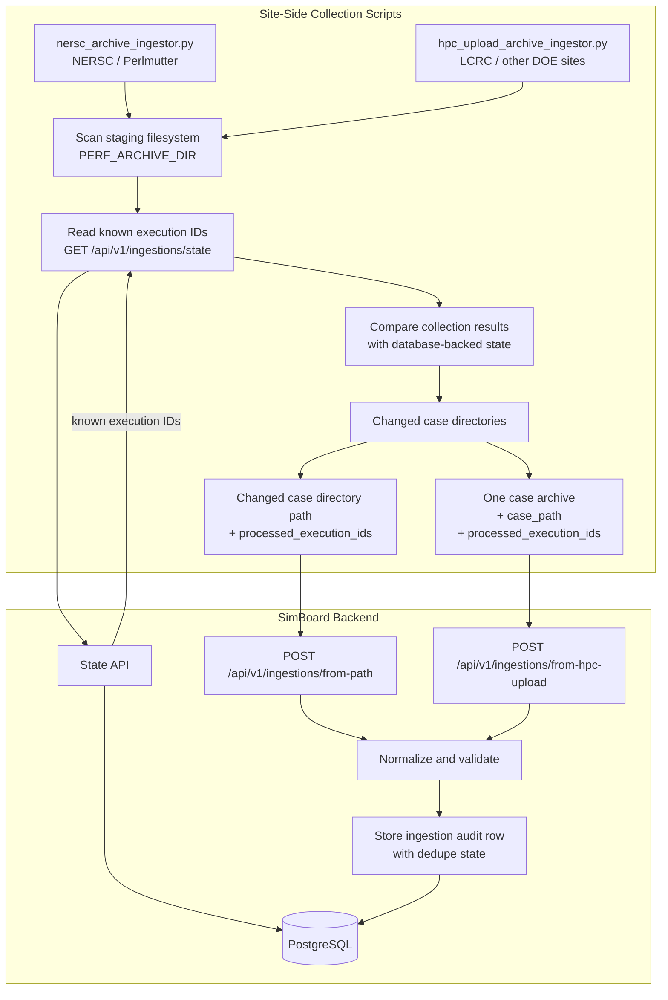

# Metadata Ingestion Architecture

HPC sites produce performance metadata that site-side automation collects and SimBoard ingests into PostgreSQL. Automated HPC collection reaches SimBoard ingestion through one of two submission workflows depending on whether the source archive is readable from the SimBoard backend environment on NERSC Spin.

Browser/manual uploads are supported separately and are not part of automated HPC dedupe reconstruction.

## Terminology

| Term              | Definition                                                                                                                                                                                                       |
| ----------------- | ---------------------------------------------------------------------------------------------------------------------------------------------------------------------------------------------------------------- |
| Collection        | Site-side scanning, discovery, validation, and packaging work that inspects case directories and their execution subdirectories to determine which parent case directories have changed and are ready to submit. |
| Ingestion         | SimBoard API and database work that accepts collected metadata, normalizes it, and persists records in PostgreSQL.                                                                                               |
| Staging directory | The active `PERF_ARCHIVE_DIR` tree where new performance output appears before PACE moves it elsewhere.                                                                                                          |
| Archive directory | The long-term `OLD_PERF_ARCHIVE_DIR` tree managed by PACE after staging output is moved.                                                                                                                         |
| Changed case      | A parent case directory selected for submission because one or more files or execution subdirectories under it changed.                                                                                          |

## Performance Directories

There are two PACE performance directories on HPC sites: staging (`PERF_ARCHIVE_DIR`) and archive (`OLD_PERF_ARCHIVE_DIR`).

> **Info**
>
> Current SimBoard automation only scans `PERF_ARCHIVE_DIR` via `PERF_ARCHIVE_ROOT`. Archive directories are listed here for site context and PACE workflow reference for future extension.

### 1. Staging directory (`PERF_ARCHIVE_DIR`)

Active filesystem location where E3SM cases write new performance output. PACE refers to this as `PERF_ARCHIVE_DIR`.

Structure:

```bash
user/
  case/
    execution/
```

Example NERSC path:

```bash
/global/cfs/projectdirs/e3sm/performance_archive
├── abarthel
│   └── 20260618.v3.LR.piControl.mct.1day-av.pm-cpu
├── adonahue
│   ├── downscaling.ne256pg2_ne256pg2.F2010-SCREAMv1.20260624
│   ├── Downscaling.ne32pg2_ne32pg2.F2010-SCREAMv1.20260616
│   ├── Downscaling.ne32pg2_ne32pg2.F2010-SCREAMv1.20260622
│   └── downscaling.y2.ne30pg2_ne30pg2.F2010-SCREAMv1.c10-sep11-f602da2b98
...
```

### 2. Archive directory (`OLD_PERF_ARCHIVE_DIR`)

Long-term filesystem location managed by PACE, referred to as `OLD_PERF_ARCHIVE_DIR`. PACE moves staging output into this directory once per day.

Structure:

```bash
year-month/
  machine-day/
    user/
      case/
        execution/
```

Example NERSC path:

```bash
/global/cfs/projectdirs/e3sm/OLD_PERF
├── 2020-06
│   ├── performance_archive_cori_e3sm_2020_06_03
│   │   ├── e3sm_perf_archive_cori_2020_06_03_out.txt
│   │   └── large-files-removed.txt
│   ├── performance_archive_cori_e3sm_2020_06_04
│   │   ├── ambradl
│   │   ├── bbye
│   │   ├── bogensch
│   │   ├── e3sm_perf_archive_cori_2020_06_04_out.txt
│   │   ├── jinyun
│   │   ├── large-files-removed.txt
│   │   ├── ndk
│   │   ├── pace-wadeburgess-2020-06-04-08:27:26.log
│   │   ├── sprice
│   │   ├── terai
│   │   ├── whannah
│   │   ├── wlin
│   │   └── ...
...
```

## Site Summary

| Site / Machine     | Collection / submission mode    | Scheduler                      | Staging directory (`PERF_ARCHIVE_DIR`)                | Archive directory (`OLD_PERF_ARCHIVE_DIR`)  |
| ------------------ | ------------------------------- | ------------------------------ | ----------------------------------------------------- | ------------------------------------------- |
| NERSC / Perlmutter | Local path submission           | Cron                           | `/global/cfs/projectdirs/e3sm/performance_archive`    | `/global/cfs/cdirs/e3sm/OLD_PERF`           |
| LCRC / Chrysalis   | Remote automated archive upload | Sandia Jenkins                 | `/lcrc/group/e3sm/PERF_Chrysalis/performance_archive` | `/lcrc/group/e3sm/PERF_Chrysalis/OLD_PERF`  |
| SNL / Compy        | Remote automated archive upload | Sandia Jenkins                 | `/compyfs/performance_archive`                        | `/compyfs/OLD_PERF`                         |
| ALCF / Aurora      | Remote automated archive upload | ALCF GitLab job, daily at 7 AM | `/lus/flare/projects/E3SM_Dec/performance_archive`    | `TODO`                                      |
| OLCF / Frontier    | Remote automated archive upload | Local cron job                 | `/lustre/orion/proj-shared/cli115`                    | `/lustre/orion/cli115/proj-shared/OLD_PERF` |

## Collection and Submission Modes

Automated HPC collection reaches SimBoard ingestion through two site-side submission modes. Both use database-backed dedupe state, but they submit changed cases through different routes:

- `nersc_archive_ingestor.py` for local path submission on NERSC / Perlmutter
- `hpc_upload_archive_ingestor.py` for remote automated archive upload from LCRC and other DOE sites

| Mode                            | Script / entry point             | Access pattern                                                                        | Route                                | Use when                                        | Examples                          |
| ------------------------------- | -------------------------------- | ------------------------------------------------------------------------------------- | ------------------------------------ | ----------------------------------------------- | --------------------------------- |
| Local path submission           | `nersc_archive_ingestor.py`      | Site-side collection submits a mounted case directory path inside `PERF_ARCHIVE_DIR`. | `/api/v1/ingestions/from-path`       | Source archive is readable from NERSC Spin.     | NERSC / Perlmutter                |
| Remote automated archive upload | `hpc_upload_archive_ingestor.py` | Site job uploads one changed case archive over HTTPS.                                 | `/api/v1/ingestions/from-hpc-upload` | Source archive is not readable from NERSC Spin. | LCRC / Chrysalis; other DOE sites |
| Browser/manual upload           | N/A                              | User uploads an archive through the browser.                                          | `/api/v1/ingestions/from-upload`     | Manual, test, or ad hoc ingestion is needed.    | User workstation                  |

### Automated Dedupe Flow

Both automated scripts follow the same dedupe sequence:

1. Scan `PERF_ARCHIVE_DIR` for case directories and metadata.
2. Read known execution IDs from `/api/v1/ingestions/state`.
3. Compare the collection results with database-backed state.
4. Submit changed cases with the full discovered `processed_execution_ids` set.
5. SimBoard stores the submitted dedupe state on ingestion audit rows.
6. Future runs reconstruct dedupe state from PostgreSQL.

Remote automated uploads must contain exactly one case directory per request. The submitted `case_path` is used as the stable dedupe key for that uploaded case.



### Runner Configuration

All automated ingestion requests require a bearer API token. Both site-side runners use:

- `SIMBOARD_API_BASE_URL`
- `SIMBOARD_API_TOKEN`
- `PERF_ARCHIVE_ROOT`
- `MACHINE_NAME`
- `DRY_RUN`

They also support these tuning options:

- `MAX_CASES_PER_RUN`
- `MAX_ATTEMPTS`
- `REQUEST_TIMEOUT_SECONDS`

### Stored Results

After ingestion, SimBoard stores normalized cases, simulations, machines, artifacts, links, and audit records in PostgreSQL. Simulation rows preserve parsed `CASE_HASH` values so the frontend can group related executions inside a case without assigning persistent reference runs. The frontend reads the resulting catalog data through `/api/v1` endpoints.

> **Note**
>
> SimBoard records artifact references such as output directories, source archive locations, run scripts, and batch logs to support reproducibility.
>
> Referenced source archive directories may be cleaned up by scheduled site-side jobs outside of SimBoard to limit storage growth.

### Reference: PACE Upload Scripts

PACE uses site-specific upload scripts and schedulers to collect or upload metadata from `PERF_ARCHIVE_DIR`. These serve as references for existing DOE-site automation and are not part of the SimBoard ingestion API. They also provide context for the design of the remote automated upload workflow and the expected contents of staged performance metadata.

Source: [PACE Collection and Upload Reference](https://e3sm.atlassian.net/wiki/spaces/EPG/pages/5477335106/PACE+Collection+and+Upload+Reference)
