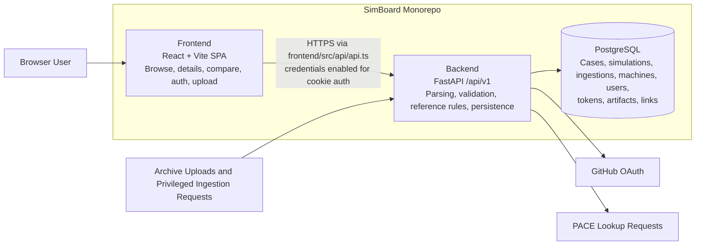
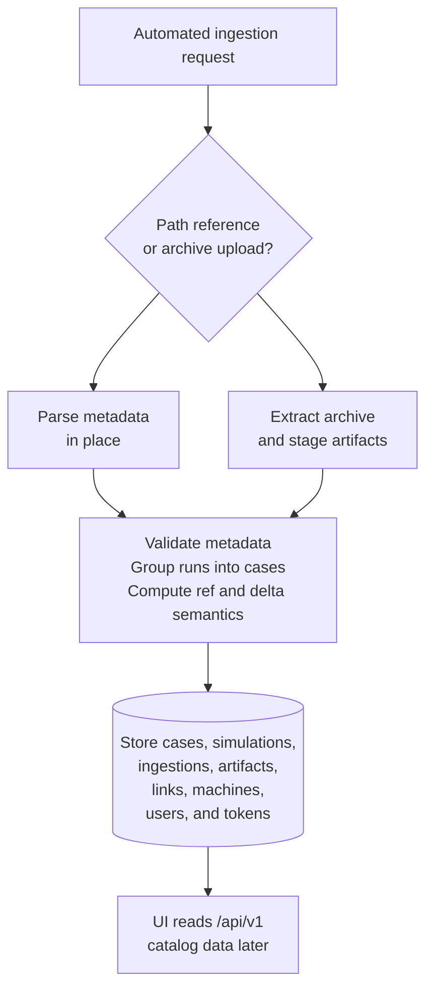

# Developer Guide

Use this guide for local setup, repo-wide development workflow, and contributor-oriented architecture. For service-specific detail, see [backend/README.md](../../backend/README.md) and [frontend/README.md](../../frontend/README.md).

## Local Setup

Prerequisites:

- Docker Desktop or compatible local Docker runtime
- `uv`
- Node.js and `pnpm`

Recommended first-run flow from the repository root:

```bash
make setup-local
make backend-run
make frontend-run
```

Open:

- API docs: `https://127.0.0.1:8000/docs`
- UI: `https://127.0.0.1:5173`

What `make setup-local` does:

- copies `.envs/example/*` into `.envs/local/` if missing
- generates local TLS certs in `certs/`
- starts PostgreSQL from `docker-compose.local.yml`
- installs backend and frontend dependencies
- runs Alembic migrations
- seeds development data

Useful commands:

```bash
make backend-test
make frontend-lint
make pre-commit-run
pnpm --dir frontend run type-check
make help
```

## GitHub Auth Setup

If you need authenticated browser flows such as upload:

1. Create a GitHub OAuth app with homepage `https://127.0.0.1:5173`.
2. Set the callback URL to `https://127.0.0.1:8000/api/v1/auth/github/callback`.
3. Put the GitHub credentials in `.envs/local/backend.env`.
4. Restart `make backend-run`.

If you need admin-only local flows such as service-account or token provisioning:

```bash
make backend-create-admin
```

For token-based ingestion and service-account details, see [docs/hpc_api_token_authentication.md](../hpc_api_token_authentication.md).

## Architecture



SimBoard is a monorepo with a React frontend, a FastAPI backend, and PostgreSQL as the primary datastore.

- backend responsibility:
  parse ingested archives, apply validation and reference-simulation rules, persist cases/simulations/ingestions/machines/users, and expose `/api/v1` endpoints
- frontend responsibility:
  fetch catalog data from the API, manage navigation and selection state, and render browsing, details, compare, auth, and upload flows
- database responsibility:
  store normalized case, simulation, machine, user, token, artifact, link, and ingestion records
- API boundary:
  the frontend uses `frontend/src/api/api.ts` to call the backend over HTTPS with credentials enabled for cookie auth
- external dependencies:
  PostgreSQL, GitHub OAuth, and PACE lookup requests from the backend

### High-Level Automated Ingestion Flow

This overview focuses on automated ingestion paths and the normalized records they produce. The UI consumes those persisted records after ingestion completes.



1. Automated ingestion starts with a privileged path-based request or an uploaded archive.
2. Backend parsing validates simulation metadata, groups runs into cases, computes reference and delta semantics, and creates ingestion audit records.
3. PostgreSQL stores the normalized cases, simulations, artifacts, links, machines, users, tokens, and ingestion metadata.
4. After ingestion completes, the frontend reads the catalog back through `/api/v1` endpoints and renders cases, runs, details, and comparison views.

### Detailed Ingestion API Flow

The detailed diagram below shows the token-authenticated HPC and service-account ingestion paths, including the distinct path-based and archive-upload branches.



## Repo Workflow

- start from an issue when the work is not trivial
- branch from `main`
- keep commits focused and reviewable
- use the PR template in `.github/pull_request_template.md`
- run validation from the repository root before opening a PR

Primary workflow details live in [CONTRIBUTING.md](../../CONTRIBUTING.md).

## Making Safe, Reviewable Changes

- read the touched feature before editing it
- prefer minimal diffs over broad cleanup
- keep frontend feature boundaries intact
- update the nearest backend tests when behavior changes
- add migrations when schema or persistence behavior changes
- verify both parser behavior and UI expectations when changing ingestion flows
- run pre-commit from the repository root, not from subdirectories

## Where Important Details Live

- backend service detail: [backend/README.md](../../backend/README.md)
- frontend service detail: [frontend/README.md](../../frontend/README.md)
- docs index: [docs/README.md](../README.md)
- CI/CD and deployment docs: [docs/cicd/README.md](../cicd/README.md)
