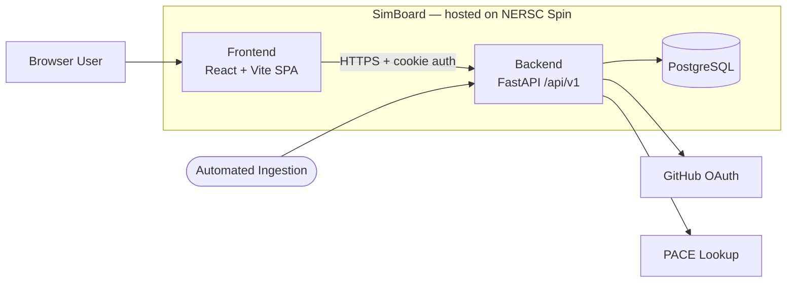
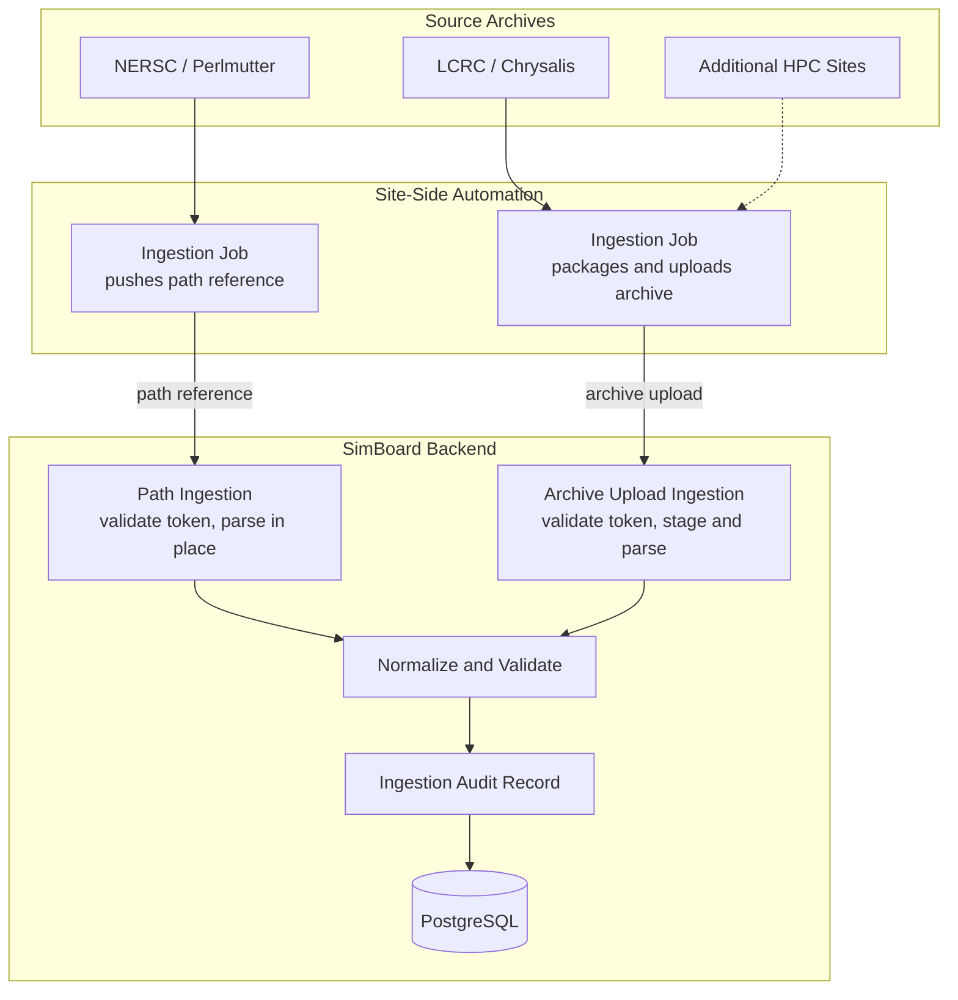

# Developer Guide

Use this guide for local setup, repo-wide development workflow, and contributor-oriented architecture. For service-specific detail, see [backend/README.md](../../backend/README.md) and [frontend/README.md](../../frontend/README.md).

## Local Setup

Prerequisites:

- [Docker Desktop](https://www.docker.com/products/docker-desktop/) or compatible local Docker runtime
- [`uv`](https://docs.astral.sh/uv/getting-started/installation/) — fast Python package manager (replaces pip/venv)
- [Node.js](https://nodejs.org/) and [`pnpm`](https://pnpm.io/installation) — JavaScript runtime and package manager

Recommended first-run flow from the repository root:

```bash
make setup-local
make backend-run
make frontend-run
```

Open:

- API docs: `https://127.0.0.1:8000/docs`
- UI: `https://127.0.0.1:5173`

What `make setup-local` does:

- copies `.envs/example/*` into `.envs/local/` if missing
- generates local TLS certs in `certs/`
- starts PostgreSQL from `docker-compose.local.yml`
- installs backend and frontend dependencies
- runs Alembic migrations
- seeds development data

Useful commands:

```bash
make backend-test          # run backend pytest suite
make frontend-lint         # lint frontend with ESLint
make pre-commit-run        # run all pre-commit hooks (formatting, linting, etc.)
pnpm --dir frontend run type-check  # TypeScript type checking (no Makefile wrapper yet)
make help                  # list all available Makefile targets
```

## GitHub Auth Setup

If you need authenticated browser flows such as upload:

1. [Create a GitHub OAuth app](https://github.com/settings/developers) with homepage `https://127.0.0.1:5173`.
2. Set the callback URL to `https://127.0.0.1:8000/api/v1/auth/github/callback`.
3. Put the GitHub credentials in `.envs/local/backend.env`.
4. Restart `make backend-run`.

If you need admin-only local flows such as service-account or token provisioning:

```bash
make backend-create-admin
```

For token-based ingestion and service-account details, see [docs/hpc_api_token_authentication.md](../hpc_api_token_authentication.md).

## Architecture

SimBoard is a web application for cataloging and comparing E3SM simulation metadata. The full application (frontend, backend, and database) is hosted on NERSC Spin. Automated ingestion jobs running on HPC sites collect metadata from an E3SM performance archive and push it to SimBoard, where the backend normalizes it and the frontend lets researchers browse, compare, and analyze results.



- **Frontend** — browse, detail, compare, auth, and upload views. Calls the backend over HTTPS via `frontend/src/api/api.ts` with credentials enabled for cookie auth.
- **Backend** — parses ingested archives, applies validation and reference-simulation rules, persists normalized records, and exposes `/api/v1` endpoints.
- **PostgreSQL** — stores cases, simulations, machines, users, tokens, artifacts, links, and ingestion records.
- **External services** — GitHub OAuth (user login) and PACE (performance lookup).

## Automated HPC Metadata Ingestion

HPC sites automatically produce `performance_archive` metadata. Automated ingestion jobs running on those sites collect the metadata and push it to SimBoard through one of two ingestion modes:

- **Path ingestion** — an ingestion job sends a path reference to SimBoard, and the backend reads the archive directly from a mounted filesystem (used when the site's storage is accessible to NERSC Spin, e.g., NERSC / Perlmutter).
- **Archive upload** — an ingestion job packages the archive and uploads it to SimBoard over HTTPS (used when the filesystem is not accessible from NERSC Spin, e.g., LCRC / Chrysalis).



All ingestion requests require a bearer API token. Site-side ingestion jobs are configured with machine name, source path, API URL, state path, dry-run flag, and the token.

After ingestion completes, the backend stores normalized cases, simulations, machines, artifacts, links, and audit records in PostgreSQL. The frontend reads the resulting catalog data through `/api/v1` endpoints.

| Site                 | Ingestion mode            | Source archive location                                                |
| -------------------- | ------------------------- | ---------------------------------------------------------------------- |
| NERSC / Perlmutter   | Path reference            | `/global/cfs/projectdirs/e3sm/performance_archive`                     |
| LCRC / Chrysalis     | Archive upload            | `/lcrc/group/e3sm/PERF_Chrysalis/performance_archive`                  |
| Additional HPC sites | Archive upload by default | Site-specific `performance_archive` path, packaged by the site wrapper |

## Contributing

See [CONTRIBUTING.md](../../CONTRIBUTING.md) for issue, branch, commit, and PR expectations.

Key habits for safe changes:

- read the touched feature before editing it
- keep frontend feature boundaries intact (`eslint-plugin-boundaries` enforces this)
- update backend tests when behavior changes
- add Alembic migrations when schema changes
- run `make pre-commit-run` from the repository root, not from subdirectories

## Where Important Details Live

- backend service detail: [backend/README.md](../../backend/README.md)
- frontend service detail: [frontend/README.md](../../frontend/README.md)
- docs index: [docs/README.md](../README.md)
- CI/CD and deployment docs: [docs/cicd/README.md](../cicd/README.md)
